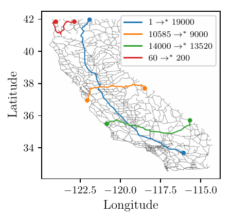
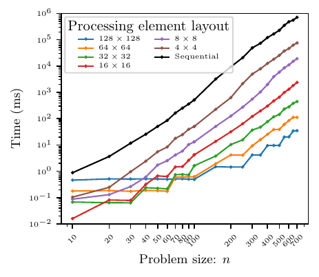
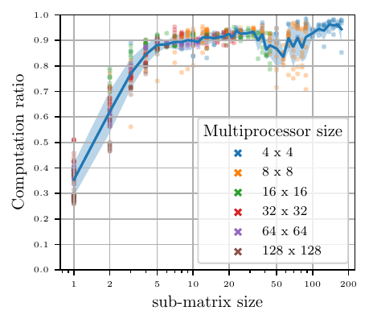
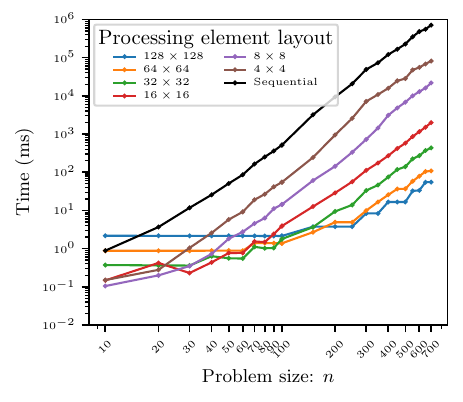
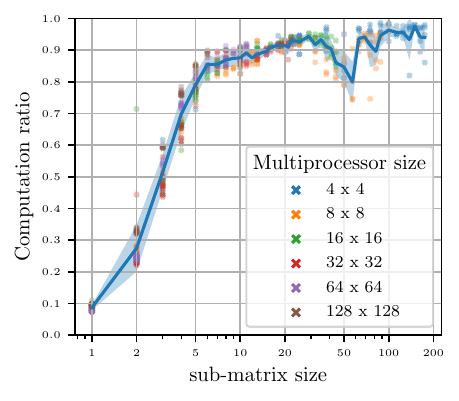
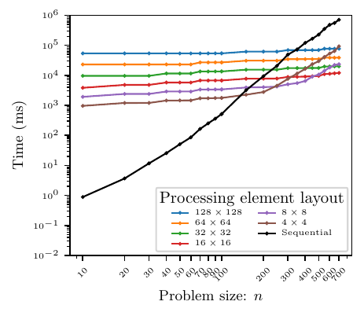
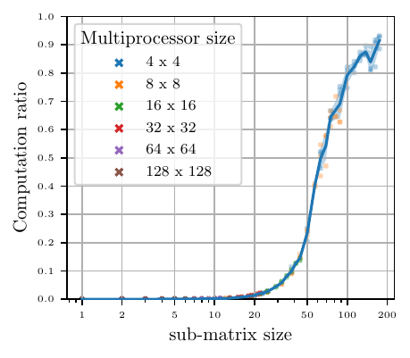

# A parallel algorithm for all-pairs shortest paths that minimises data movement


This repository contains the final year project I conducted while studying Computer Science
at the University of Cambridge, and it was supervised by Dr Jagdish Modi. The
[report](reports/dissertation/build/diss.pdf) detailing the project 
contains about 12 000 words and 75 pages, and about 5000 lines of [code](ParallelAPSP/src) was produced. As part of the project, I implemented a simulator of a massively parallel system and used this
to implement an efficient parallel algorithm for solving the all-pairs shortest paths (APSP)
problem. The performance of this algorithm was then analysed quantitatively and I demonstrated
that the algorithm could efficiently be scaled up to $128^2$ processing elements (computer cores).

_The full report can be found here: [dissertation.pdf](reports/dissertation/build/diss.pdf)._

_The project received a mark of **76.5/100**_



**README**:
* [Abstract](#abstract)
* [Repository overview](#repository-overview)
* [Parallel computation API](#parallel-computation-api)
* [Results](#results)

## Abstract

I implemented a simulator of a massively parallel system with an interface that
was simple to use. A parallel all-pairs shortest paths (APSP) algorithm based
on matrix multiplication was then implemented using this interface, and was
further generalised to handle any combination of processing element grid size
and problem size. I then extended the simulator with functionality for
accurately timing execution, and optimised the algorithm with graph
compression.  Finally, I performed a quantitative analysis on the benefit of
parallel computation where I considered different types of systems and problem
sizes. The algorithm developed was able to efficiently solve APSP on large scale
real-world road datasets, such as the California road network dataset which contains
more than 20 000 vertices.

## Repository overview

Note: A more thorough overview of the code is presented on page 24 in the
[report](reports/dissertation/build/diss.pdf).

* [`ParallelAPSP/src/main/java/`](ParallelAPSP/src/main/java)
  * This folder contains all the Java code for the simulator and parallel algorithm
* [`ParallelAPSP/src/test/java/`](ParallelAPSP/src/test/java)
  * This folder contains all the unit tests
* [`reports/`](reports)
  * This folder contains the project proposals, the progress report made, and the final
    dissertation
* [`research-and-planning/`](research-and-planning)
  * This folder contains development logs, requirement analyses, etc.
* [`scripts/`](scripts)
  * This folder contains various utility scripts and python scripts for plotting the data
* [`test-datasets/`](test-datasets)
  * This folder contains graph datasets used as part of the unit tests

## Parallel computation API

The repository provides a simple-to-use API for creating massively parallel programs and timing these on different
architectures. Below is an example of a simple usage.

We specify what work to carry out at each processing element by extending the `Worker` class in `MatrixMultiplicationWorker.java`.
In this example, we create a simple parallel matrix multiplication algorithm using row and column broadcasting.

```java
package matrixMultiplication;

import memoryModel.CommunicationChannelCongestionException;
import memoryModel.CommunicationManager;
import memoryModel.PrivateMemory;
import work.Worker;

/**
 * This worker assumes two input matrices, stored in location "A" and "B", respectively.
 * The worker will then together multiply the matrices and store the result in "C".
 */
public class MatrixMultiplicationWorker extends Worker {

  public BroadcastMatrixMultiplication(int i, int j, int p, int n, int numPhases, PrivateMemory privateMemory, CommunicationManager communicationManager) {
    super(i, j, p, n, numPhases, privateMemory, communicationManager);
  }

  @Override
  public void initialisation() {
    store("C", 0);
  }

  @Override
  public void computation(int l) {
    double value = readDouble("rowA") * readDouble("colB") + readDouble("C");
    store("C", value);
  }

  @Override
  public void communicationBefore(int l) throws CommunicationChannelCongestionException {
    if (i == l) {
      broadcastCol(readDouble("B"));
    }
    if (j == l) {
      broadcastRow(readDouble("A"));
    }
    receiveColBroadcast("colB");
    receiveRowBroadcast("rowA");
  }

  @Override
  public void communicationAfter(int l) throws CommunicationChannelCongestionException { }
}
```

We then wrap this work specification in a `Manager` and wrap a timing

```java
/*** Create the input matrices ***/

Double[][] A = {
  {1., 5., 42.},
  {6., 7., 12.},
  {45., 12., 45.}
};
Double[][] B = {
  {0., -23., 2331.,},
  {3.14, 23.232, -1.},
  {2.71, 1., 1.}
};
Map<String, Matrix<Number>> initialMemory = new HashMap<>();
initialMemory.put("A", new Matrix<>(3, A));
initialMemory.put("B", new Matrix<>(3, B));

/*** Create the manager ***/

// We create a grid of 3 x 3 processing elements and tell them 3
// phases of work are required to finish computation. See the docs
// of Manager for more information.
Manager m = new Manager(3, 3, initialMemory, MatrixMultiplicationWorker.class);

// (optional) If we want to time the execution, we can wrap the manager in a
// timer object, from which we can extract a timing summary after computation

MultiprocessorAttributes system = new MultiprocessorAttributes(
  // CPU cycles per seconds
  10,
  // CPU cycles for point-to-point communication
  10,
  // CPU cycles required for broadcast communication
  15,
  // Bandwidth (bytes per cycle) for point-to-point communication
  40,
  // Bandwidth (bytes per cycle) for broadcast communication
  100
);

// we need to specify both the system characteristics and the communication topology to use
TimedManager tm = new TimedManager(m, system, SquareGridTopology::new);

/*** Simulate the execution ***/

try {
  tm.doWork();
  // If not timing the execution, run this instead:
  // m.doWork();
} catch (CommunicationChannelException | WorkersFailedToCompleteException e) {
  e.printStackTrace();
  fail("Manager failed to complete execution");
}

/*** Extract the result ***/

// The result of the computation can be extracted as a Matrix
Matrix<Number> result = tm.getResult("C");

// We can also extract the execution and communication times measured
TimingAnalysisResult times = tm.getTimingAnalysisResult();
```

## Results

Below, I have plotted the total execution time and the ratio of computation to communication
for three different parallel systems. The first system is a multi-core processor architecture,
which is characterised by low core-to-core communication latency and high bandwidth. The second
system is a supercomputer, which has a communication latency of about 1 $\mu$s. The third system
is a distributed system, where communication happens over the Internet. The latency is thus
very high (30 ms), but the system is highly scalable.
For each of the three systems, I did measurements with several different processing element
grid sizes. The sub-matrix size in the right column represents the square root of the number of
entries each processing element is responsible for computing.

System  | Total execution time | Ratio of computation to communication
:----:|:--------------------------:|:-------------------------:
Multi-core processor (Sandy Bridge) |  | 
Supercomputer (Sunway TaihuLight) |  | 
Distributed computer (internet) |  | 

We notice a general trend of decreased computation time with more processing elements.
This means that communication does not become an overhead. This is especially the case when
the problem size gets large. In the rightmost column, we see that we achieve a computation
ratio of above 90% in all three cases, which means that there is a large advantage to parallel
computation, even when the processing elements have massive communication latency which is the
case with the distributed system.
